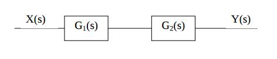
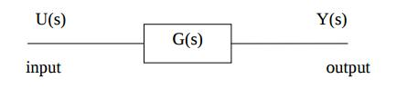
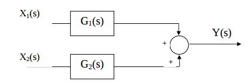
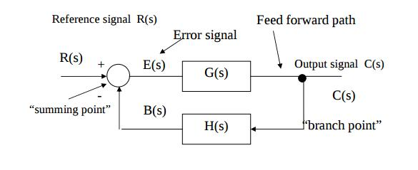

# Lecture 6 - Notes
January 19th, 2016

## Block Diagrams

- A block diagram is a diagram of a system in which the system is represented as a a series of connected systems.

### Basic Structures

#### Series (Cascade)

- Defined by

$$
Y(s) = G(s)X_{1}(s) + G_{2}(s)X_{2}(s)
$$

#### Open Loop

- No feedback loop therefore any disturbance or change in conditions may reduce the ability to complete the desired task

#### Parallel

- Defined by
$$
Y(S) = G_{1}(s)G_{2}(s)X(s)
$$

#### Closed Loop (Feedback Loop)

- The output of a system is routed back as an input to the system (the system _feeds back_ into itself)

- Open-loop transfer function

$$
\frac{Outputs}{Inputs} = \frac{C(s)}{R(s)} = \frac{G(s)}{1 + G(s)H(s)}
$$

#### Signal Flow Graph Rules

## Signal-Flow Graph (Mason Graph)

- Specialized simplification of a block diagram
- Summing symbols and takeoff points are eliminated and are replaced with nodes
- The components or subsystems are
