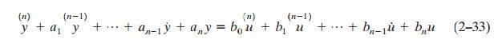
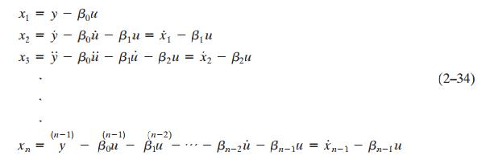
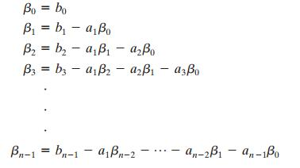
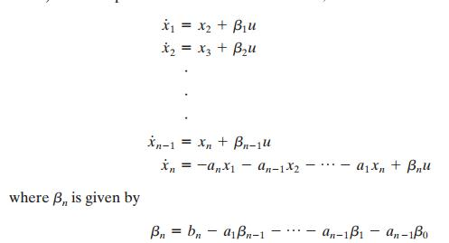

# Chapter 2 Modeling of Control Systems

## State Space Representations of nth-Order Systems of Linear Differential Equations

Equations of the form 

Obtain a series of equations in terms of x where

Where $\beta$  is

- Note that this will always result in a unique state solution if we choose our variables this way.
- $a_0$ must always be equal to 1

These beta values are chosen because they have the property

