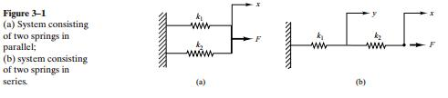
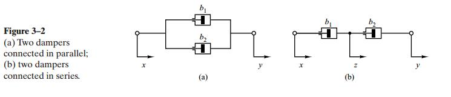
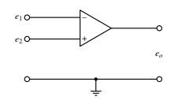

# Chapter 3

This chapter looks at mathematical modeling of mechanical systems and electrical systems.

__ Impeadence __ : is the measure of the opposition that a circuit presents to a current when a voltage is applied.

## 3-2 Mathematical Modeling of Mechanical Systems

To obtain the equivalent spring constant from the above image

### In parallel
$$
    k_1x + k_2x = F = k_{eq}x \\\\
    k_{eq} = a_1 + k_2
$$

### in series

$$
    k_{eq} = \frac{1}{\frac{1}{k_{1}} + \frac{1}{k_2}}
$$

A __dashpot__ is a device that provides viscous friction. The equation is modeled identically to the spring coefficients except that the derivative is the

The Viscous coefficient $ b $ follows a similar pattern

### In parallel

$$
    f = b_{eq} (\dot{y} - \dot{x}) \\\\
    b_{eq} = b_1 + b_2
$$

### In Series

$$
    b_{eq} = \frac{1}{\frac{1}{b_{1}} + \frac{1}{b_2}}
$$

## Mathematical Modeling of Electrical Systems
- Kirchoffs current law (Node Law)
    - the algebraic sum of all currents entering and leaving a node is zero.
    - The sum of currents entering a node is equal to the sum of currents leaving the same node
- Kirchoffs Node law (Loop Law)
    - At any given instant the algebraic sum of the voltages around a loop in an electrical circuit is zero
    - The sum of the voltage drops is equal to sum sum of the voltage rises around a loop

## LRC Circuit
    - The inductance L (henry)
    - The resistance R (ohm)
    - The capacitance C (frand)

## Operational Amplifier (Op amp)

* The input into the minus terminal is inverted and input to the positive is not. The opamp is defined by

$$
  e_0 = K(e_2-e_1) = -K(e_1-e_2)
$$

Where the e's are input voltages
