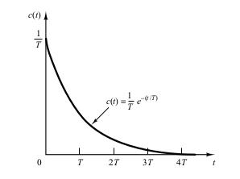
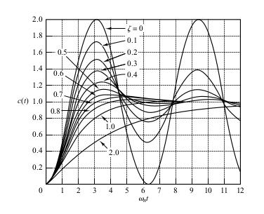
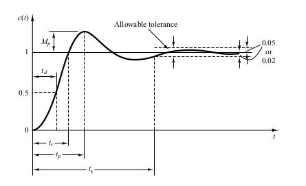

# Chapter 5 - Transient and Steady State Response Analyses

This chapter is concerned with system responses to aperiodic signals (such as step, ramp, acceleration, and impulse functions of time).

The Time Response is the response of the signal in the time domain (the continuous time function)

This time response is composed of the Transient response and the steady-state response

The __transient response__ is the transition between the initial state and the steady-state

The __steady state__ is the manner in which the system output behaves as t approaches infinity

__Absolute Stability__ wether the system is stable or unstable

__critically stable__ oscillations of the output continue forever

__Relative Stability__

__Steady-State Error__

## First Order Systems

This the unit step response.

This is the unit ramp response

This is the unit impulse response

## Second Order System

### General Equation of a Second order System

$\sigma$ is called the attenuation. Which is the reduction in the strength of a signal

$$
  \sigma = \omega_n \zeta
$$

$\omega_n$ the undamped natural frequency is the frequency that the system would oscillate at if the dampening ratio was decreased to zero.

$\omega_d$ is the observed damped natural frequency which is equal to

$$
  \omega_n \sqrt{1-\zeta^2}
$$

$\zeta$ is the damping ratio of the system. The damping ratio $\zeta$ is the ratio of the actual damping B to the critical damping $B_c = 2\sqrt{JK}$ or

This is a graph showing the graphs of the damped signals as you vary the damping ration $\zeta$

### Transient Response Specifications

$c(\infty)$  is the steady state output

1. Delay time $t_d$ time to reach 50 percent of desired output
2. Rise time, $t_r$ time to rise from 0 to 100%
$$
  t_r = \frac{1}{w_d} tan^{-1} (- \frac{\omega_d}{\sigma})
$$
3. Peak time, $t_p$ time to rise to the first peak
$$
\frac{\pi}{\omega_d}
$$
4. Maximum percent overshoot, $M_p$

$$
  M_p = \frac{c(t_p) - c(\infty)}{c(\infty)}
$$

5. Settling time, $t_s$ time to stay within a 2% or 5% tolerance of the final value

These are shown on the graph below

